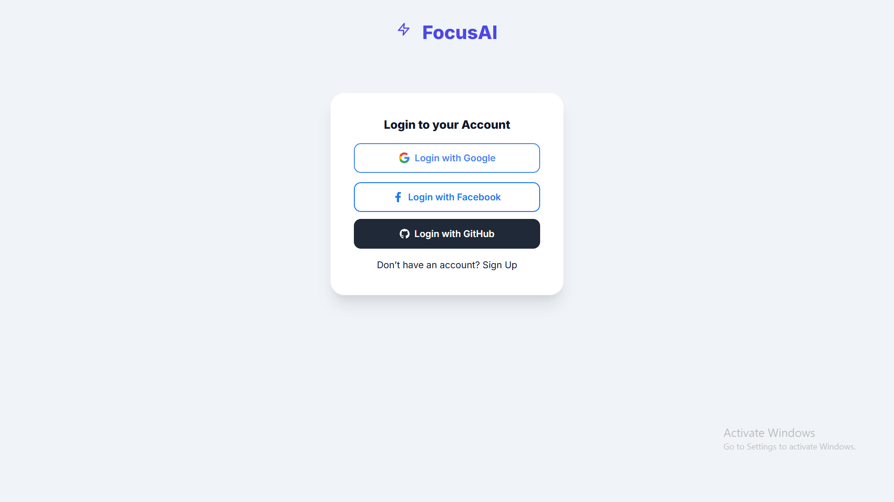
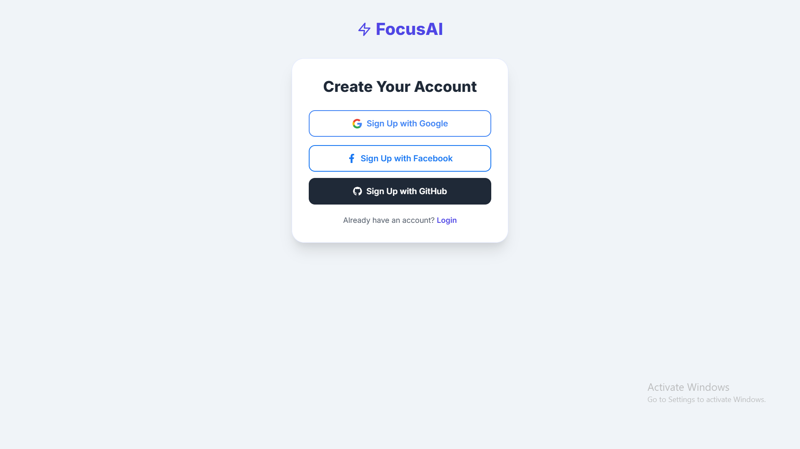
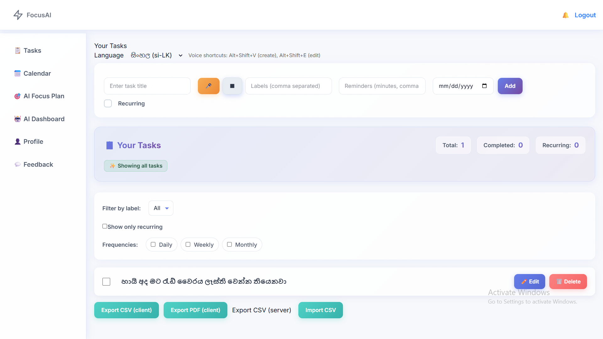
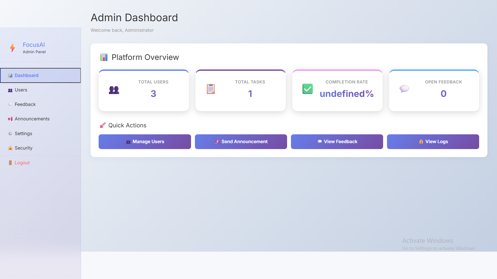
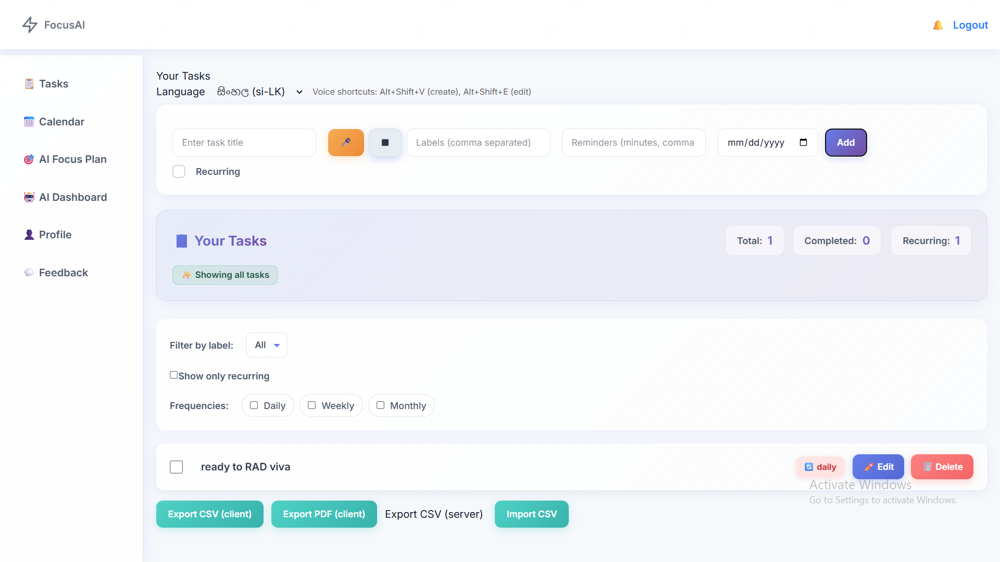
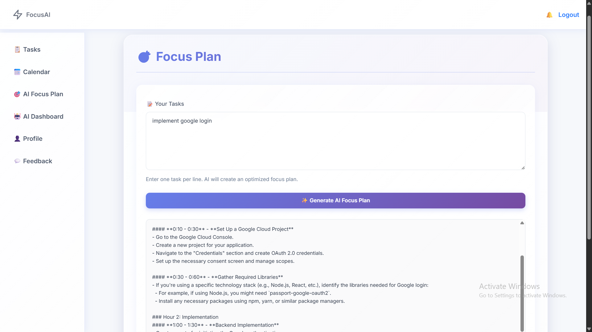

# Task & Focus Manager — Backend (TypeScript/Express/Mongo)

Robust task manager backend with JWT + Google/Facebook/GitHub OAuth, reminder emails (cron + Nodemailer), recurrence workers, and AI endpoints. Built with TypeScript, Express, Mongoose.

## Deployed URLs & Hostnames
- **Backend (API):** https://task-focus-backend.fly.dev
- **Frontend (primary):** https://task-focus-frontend-1xnv.vercel.app


## Quick Start (Local)
```powershell
cd c:\Users\ahasna\Documents\sem-3\RAD\task-management\backend
npm install
npm run dev           # start dev server (ts-node-dev)

# optional
npm run build         # typecheck/compile to dist
```

### Required Environment
- `MONGO_URI` — MongoDB connection string (default `mongodb://localhost:27017/taskfocus`).
- `JWT_SECRET` — secret to sign JWTs.

### Optional / Feature Flags
- `JWT_EXPIRES_IN` — JWT TTL (default `7d`).
- Google OAuth: `GOOGLE_CLIENT_ID`, `GOOGLE_CLIENT_SECRET`, `GOOGLE_CALLBACK_URL`.
- Facebook OAuth: `FACEBOOK_APP_ID`, `FACEBOOK_APP_SECRET`, `FACEBOOK_CALLBACK_URL`.
- GitHub OAuth: `GITHUB_CLIENT_ID`, `GITHUB_CLIENT_SECRET`, `GITHUB_CALLBACK_URL`.
- Email: `EMAIL_USER`, `EMAIL_PASS` (Gmail App Password) — used by Nodemailer.
- Reminders: `REMINDER_NO_DUE_DAYS` (int days before nagging no-due-date tasks; default 1).
- Frontend redirect: `FRONTEND_URL` (default `http://localhost:5173`).

## Deployment (Render example)
1) **Create service**: New Web Service → connect this repo → Root dir `backend` → Runtime `Node 18+`.
2) **Build & run commands**:
	- Build: `npm install && npm run build`
	- Start: `npm run start` (ensure `start` runs `node dist/index.js` in package.json)
3) **Environment variables**: add all from `.env` (no quotes). Set a production `JWT_SECRET`, cloud `MONGO_URI`, and new `EMAIL_PASS` app password.
4) **Keep server warm**: Render autosleep is fine; cron runs only while container is up. If you need guaranteed reminders, use a Background Worker or an external cron hitting the `/api/test/send-reminders` endpoint.
5) **Redirects**: Set `FRONTEND_URL` to your deployed frontend origin so OAuth callbacks redirect correctly.

## Deployment (Vercel/Netlify notice)
This backend requires long-lived server processes and cron. Prefer Render/railway/fly.io/Azure Web App/Heroku. Vercel/Netlify serverless will not run the cron job.

## Cron & Reminders
- Scheduled daily at **09:07** (`cron.schedule('7 9 * * *')`) in `src/jobs/taskReminder.ts`.
- Sends reminders for overdue tasks and tasks without due dates older than `REMINDER_NO_DUE_DAYS` days.
- Manual trigger: `POST /api/test/send-reminders` (requires Bearer JWT); useful to verify email delivery.

## Admin Setup
- Test helper: `POST /api/test/make-admin` with body `{ email, name? }` to promote/create an admin.
- OAuth logins return `role`; frontend should redirect admins to the dashboard based on `role === 'admin'`.

## OAuth
- Google/Facebook/GitHub strategies defined in `src/config/passport.ts`.
- Callback URLs must match provider configs; update `.env` accordingly.
- Frontend should start OAuth by visiting `/api/auth/{google|facebook|github}` and handle `/auth-callback` with the returned token.

## Scripts
- `npm run dev` — ts-node-dev with restart.
- `npm run build` — tsc compile to `dist/`.
- `npm run start` — run compiled server (configure in package.json if needed).

## Testing Emails
- Ensure `EMAIL_USER/EMAIL_PASS` are set (Gmail app password).
- Run the server, then call `/api/test/send-reminders` with a valid JWT. Check logs for send status.

## Folder Structure
- `src/index.ts` — app bootstrap, CORS, routes, workers.
- `src/jobs/` — recurrence runner, reminder runner, daily email cron.
- `src/routes/` — auth, tasks, test helpers.
- `src/config/passport.ts` — OAuth strategies.

## Troubleshooting
- Gmail `535` login errors: regenerate app password, update `.env`, restart server.
- OAuth redirect mismatch: verify provider callback URLs match `.env` values.
- Cron not firing on free tiers: use a Background Worker or external scheduler hitting the test reminder endpoint.

## Screenshots

### Login Page


### Register Page


### User Dashboard


### Admin Dashboard


### CRUD Example


### Advanced Feature


(See the `screenshots/` folder for the image files referenced above.)
